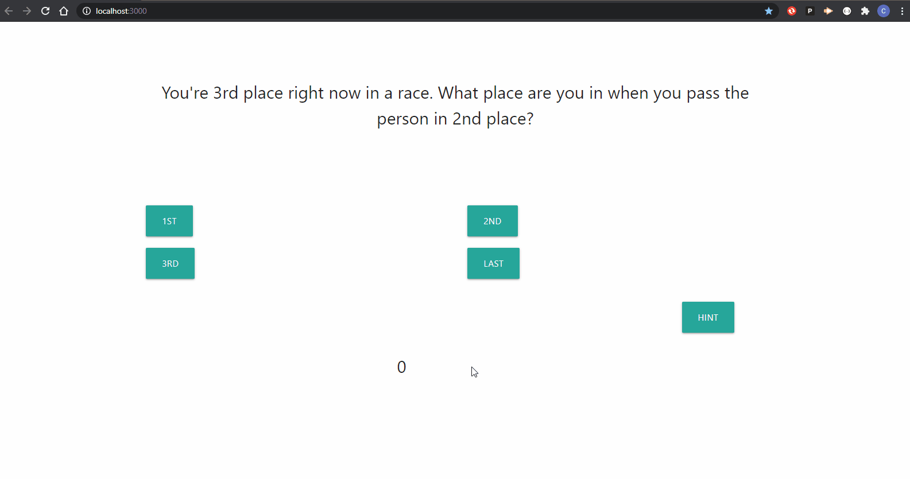

# **Smarticus**
Smarticus is a *trivia game* that makes you think out of the box. It's a fun little game that makes the player think and have a lot of fun trying to beat their high score.

The quiz:
* has 5 total questions
    * Each having four possible answer
    * Each has a hint button
* Uses an API to play sound
    * After you click on a button it plays a sound signaling if you got it right or not
* Shows your score as you're playing
* Makes the player login 
    * If they don't have an account lets them make one

**Functionality**

*Smarticus* uses mongoose to both verify the user loging in, and to store the information for the questions. As the page is being rendered the the information for each question is being pulled down to then be sorted through as the user plays the game.

This is the game in action: 

**NPM's required**
* react
* react-dom
* axios
* react-router-dom
* react-scripts
* use-sound
* bcrypt
* express
* if-env
* mongoose
* seed